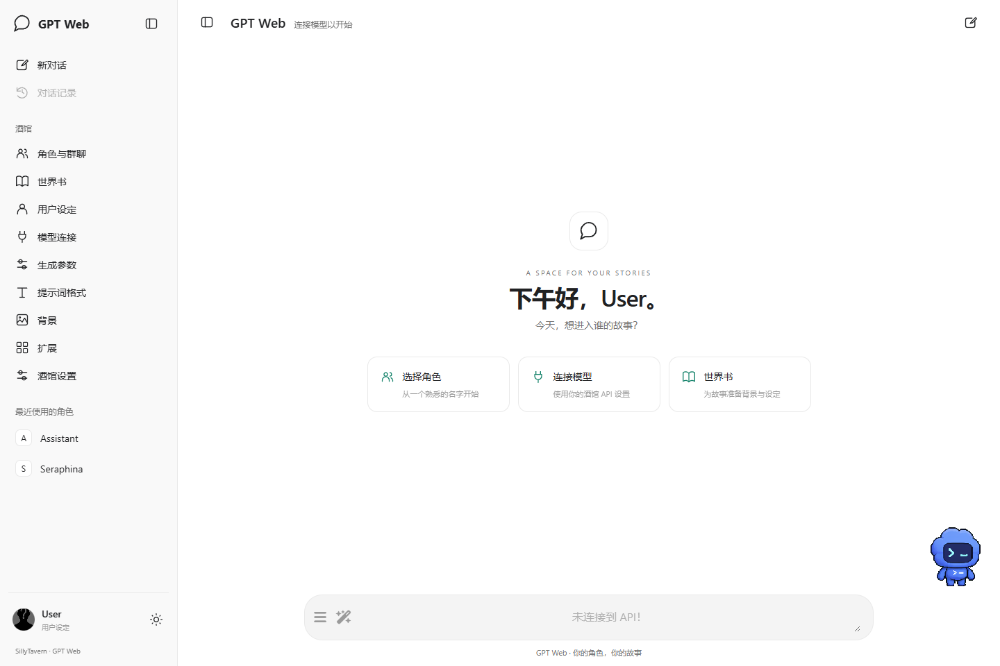
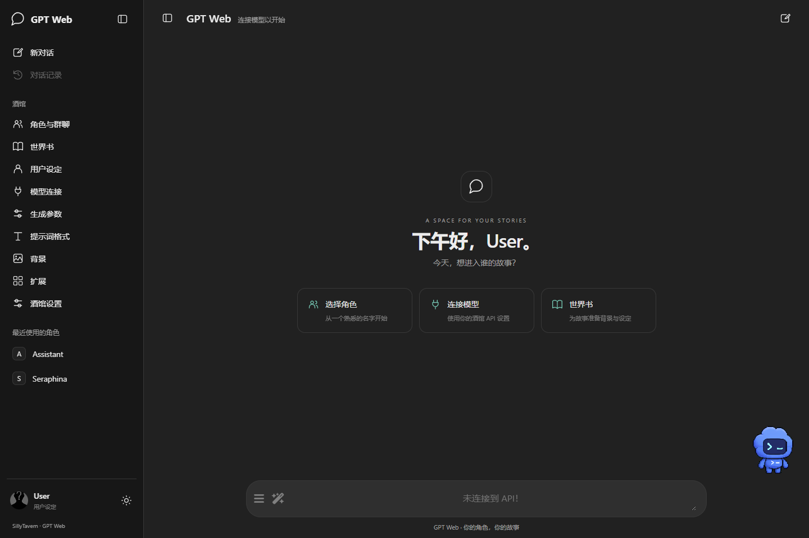

# GPT Web

一个采用 ChatGPT 风格布局的 SillyTavern 界面扩展。

保留酒馆原生聊天、角色卡、世界书、群聊、预设与模型连接。提供浅色 / 深色 / 跟随系统主题、可折叠侧栏、最近使用的角色入口、欢迎页，以及桌面和窄屏布局。

这是独立实现的第三方界面扩展，与 OpenAI 没有关联。界面名称不限制模型供应商。

## 安装

需要 **SillyTavern 1.19.0 或更新版本**；目前实际验证的版本为 1.19.0。

1. 先停用其他接管整页布局的扩展。
2. 在酒馆「扩展 → 安装扩展」中填入 `https://github.com/Wellilam/gpt-web`。
3. 刷新页面。在「扩展 → GPT Web」选择主题或关闭界面。

手动安装：将整个仓库放到 `data/<用户>/extensions/gpt-web/`，或 `public/scripts/extensions/third-party/gpt-web/`。扩展目录根部须有 `manifest.json`。

## 使用

- 左栏打开角色、世界书、模型连接、预设与生成参数等原生面板。预设入口在「预设与生成参数」，显示当前 API 类型对应的原生预设选择器。
- 其他扩展向原顶栏添加标准抽屉或按钮时，侧栏会新增「插件」入口；加载后新增、改名、移除及宿主隐藏状态会同步。点击仍交给插件原有处理器，不移动插件节点。
- 九类设置面板的标题、输入框、选择器、按钮、勾选框、滑块与折叠分组统一使用 GPT Web 的明暗配色和间距；预设与酒馆设置采用更宽松的纵向分组。提示词编辑器、确认弹窗和下拉浮层也使用相同样式，操作仍由酒馆处理。
- 手机子面板使用全宽布局。角色管理常驻搜索、新建和导入入口；展开「筛选与管理」可排序、按收藏或群聊筛选、翻页和批量管理。筛选使用带文字的灰阶按钮，选中与排除状态分别显示；角色编辑保留文字操作、返回入口和原生自动保存。切回桌面或禁用扩展会恢复原生控件位置。
- 左栏的角色列表显示最近使用的 8 个角色；完整角色与群聊列表在「角色与群聊」。
- 「对话记录」打开最近聊天，按更新时间列出各角色与群聊的记录；未选择角色时也可打开。点击一条记录恢复对应聊天，生成回复期间需先停止生成再切换。
- 「新对话」沿用酒馆原生操作和确认窗口。
- 欢迎页显示当前 Persona 名字，按浏览器本地时间切换问候：05:00 早上、11:00 中午、14:00 下午、18:00 晚上、23:00 夜间。每个时段有 4 句，共 20 句；进入时段时随机选一句，同一时段保持措辞，刷新页面可重新选择。页面每分钟检查时间，重新回到标签页时立即更新；改名或切换 Persona 后同步名字。
- 左下角显示当前 Persona 的头像和名字，点击打开用户设定；旁边的小按钮切换主题。角色列表单独滚动，个人入口保持在侧栏底部。
- 输入框上方的小精灵沿输入框范围左右散步，每次到达后随机休息 4～9 秒。鼠标靠近时停下跳跃，点击或按 Enter 招手；酒馆生成回复时停下等待。它随输入框高度调整位置，窄屏缩小显示；打开设置、手机侧栏或隐藏标签页时暂停。在「扩展 → GPT Web」可关闭宠物、选择皮肤或上传自定义图集；开关和皮肤选择保存在当前浏览器，遵循系统的减少动态效果设置。
- 原有消息编辑、重新生成、停止、文件附件与扩展按钮继续由酒馆处理。
- 聊天使用右侧用户气泡、无气泡的角色回复和正文下方的操作栏，切换回复的箭头与计数放在底部。默认收起头像、时间和统计，可在「扩展 → GPT Web」恢复这些信息。输入栏的加号打开扩展菜单，旁边打开聊天操作菜单，两者沿用 GPT 配色与可换行菜单项。
- 正则脚本名、角色名、侧栏长名称及通用文字按钮允许换行；手机正则编辑器的选项改为单列。长聊天标题会增高顶栏，正文跟随下移。
- 「扩展 → GPT Web → 主题 → 跟随酒馆主题」沿用酒馆的配色、字体和背景，保留 GPT 布局。浅色、深色和跟随系统仍可独立选择。
- 设置保存在当前浏览器的 `gpt-web:settings` localStorage 中；不更改模型地址、密钥和角色数据。

页面无法操作时，在酒馆地址后加 `?gptweb=off` 并刷新即可关闭；加 `?gptweb=on` 可恢复。这个开关会保存在当前浏览器，参数在处理后会从地址栏移除。也可从原生扩展管理中禁用或卸载。

### 宠物换肤

在「扩展 → GPT Web → 宠物皮肤」选择 Codex、Dewey、Fireball、Rocky、Seedy、Stacky、BSOD 或 Null Signal，加载完成后立即生效。

「上传自定义皮肤」接受最多 20 MB 的 PNG/WebP 动画图集。图集宽度为 1536，高度为 1872（8 列×9 行）或 2288（8 列×11 行），每格 192×208。待机、向右走、向左走、招手、跳跃和等待依次使用零起始第 0、1、2、3、4、6 行；列内帧顺序沿用 Codex 图集。自定义图片须在对应行提供动作帧，尺寸正确不代表动作内容匹配；普通单张头像需先制作成这个格式。

自定义文件保存在当前浏览器、当前酒馆地址的 IndexedDB 中，上传后自动选中「自定义图集」。可在内置皮肤和已保存图集之间切换；再次上传会替换这一份图集，错误文件不会替换已保存内容。文件不发送到服务器；清除网站数据会移除它，换浏览器或酒馆地址需要重新上传。

## 兼容边界

样式处理外壳、消息容器与输入区，不读取或重写角色卡的 iframe 内容，不向卡内 HTML 注入主题 CSS。卡片显式设置的样式保留；未自行设置的字体、颜色等仍会继承外层。主题跟随支持酒馆提供的颜色和字体变量及背景图。直接重排整页的自定义 CSS、第三方全页主题、移动 UI 和原生浮动面板仍需单独验收。

顶栏兼容范围为 `#top-settings-holder` 的直接子项：标准 `.drawer > .drawer-toggle`，以及按钮、链接、`role="button"` 或 `.menu_button`（含一层容器）。原插件须自行绑定入口行为；代理同步 `hidden`、内联隐藏与宿主 `.displayNone`／`.hidden` 状态。依赖原按钮坐标、仅处理 pointer 事件或使用其他自定义结构的插件需要按实际对象适配；当前隔离实例没有安装这些第三方插件，不声明通用兼容。

## 开发

无需构建工具或额外 JavaScript 运行库。`manifest.json` 是扩展入口，`index.js` 使用宿主的 `SillyTavern.getContext()`，`style.css` 导入负责设置面板的 `panels.css` 和消息外壳的 `chat.css`，全部通过根节点的 `.gptweb` 开关生效。`navigation.js` 发现动态顶栏入口；`pet.js` 管理宠物显示、动画与清理。

内置宠物的图集从 OpenAI 公共 CDN 加载，规格和帧布局依据 [官方 Codex pets 目录](https://github.com/openai/codex/tree/main/codex-rs/tui/src/pets)。选择内置皮肤会向 `persistent.oaistatic.com` 请求图片，不向该请求提供聊天内容或 API 密钥；网络失败会在扩展设置中显示提示。图片保留在原服务，未打包进本仓库，也不属于本项目 MIT 许可证覆盖的素材。这里没有读取或同步 Codex 桌面应用的当前宠物选择。

验证结果和实际限制见 [VALIDATION.md](VALIDATION.md)。

