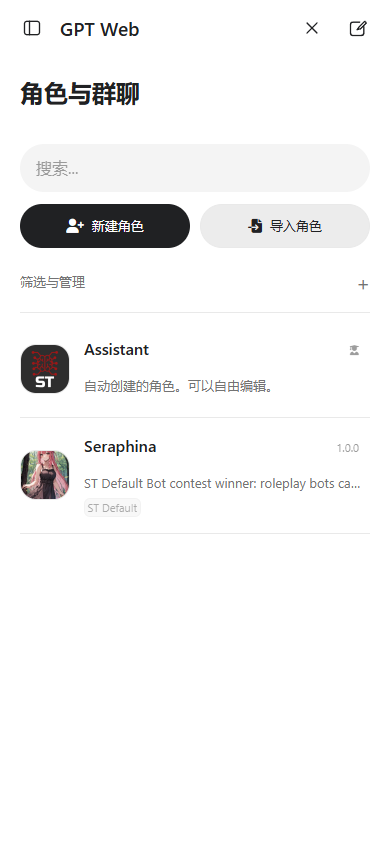
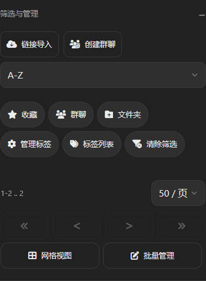
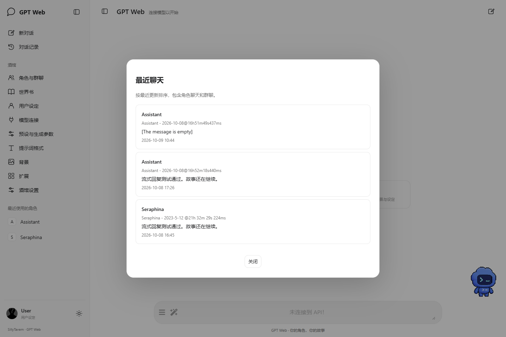
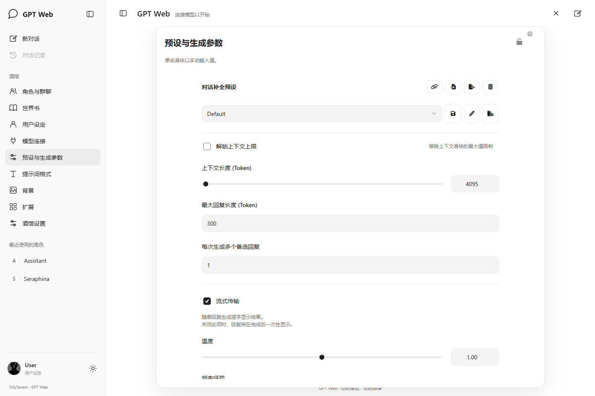
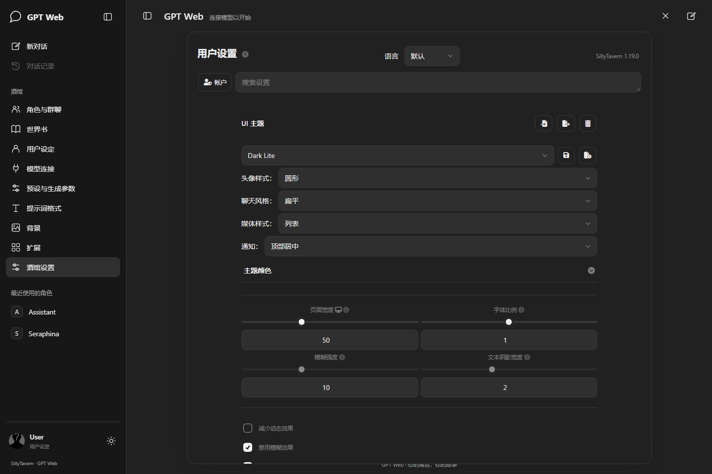

# 验证记录

核验日期：2026-10-08。运行环境：Windows，SillyTavern **1.19.0**，Chrome **153.0.8010.53**，Playwright。

使用独立 dataRoot 的真实酒馆实例与原生扩展加载器。测试数据只包含酒馆默认示例角色、测试 Persona 与测试消息。没有在用户日常实例中安装或修改扩展。

## 0.3.1 展开工具后的宽度稳定（2026-10-09）

- 使用显示系统滚动条的 Chrome 复现：390px 下，展开角色管理工具后，滚动条占用 15px，搜索、按钮和列表从 350px 缩到 335px。此前无头测试默认隐藏滚动条，未覆盖这个变化。
- 手机角色管理的主滚动区设置 `scrollbar-width: none`，保留原生滚动，取消滚动条占宽；桌面样式保持原状。
- 320／390／700px 宽度与 844／480px 高度的六组检查通过：展开前后各控件宽度相同，主滚动区占宽为 0，只有一层发生纵向滚动。真实鼠标滚轮、浏览器触摸滑动模拟、末项角色点击均通过，切回桌面恢复原滚动条规则，无页面异常。未在实体手机上测试。

## 0.3.0 手机角色管理（2026-10-09）

- 手机子面板改为全宽平面布局，控件使用 16px 输入字体；角色列表常驻搜索和新建／导入入口，次级工具收进「筛选与管理」。整理列表与网格、返回入口、角色编辑工具和正文输入区。
- 单独处理角色筛选与分页：移除原生彩色滤镜，六个筛选操作补上文字，选中使用主题反色，排除使用虚线和「排除」文字；分页、网格与批量管理按钮增大到 44px，保留原生状态与事件。
- 320、390、700px 手机宽度的明暗主题、列表／网格、排序与横向边界实测通过。真实点击导入按钮打开文件选择器，搜索过滤现有角色；创建临时角色、编辑描述、刷新后核对保存内容。群聊创建页打开和返回正常。
- 编辑中的未保存表单在桌面与手机宽度切换后保持；禁用后原生控件位置恢复，重启无重复节点。手机常驻搜索只覆盖扩展样式，不写入宿主的搜索显隐偏好。
- 收藏筛选三态、清除筛选和批量管理开关实测通过；用 11 个角色验证下一页及返回首页，恢复原分页数量并清除 9 个临时复制角色。最终角色目录只保留两个原有示例角色。
- 角色管理 7 组专项检查、九类面板的 36 组桌面／手机明暗主题检查、12 项基础界面回归均通过，无页面异常。Node 语法、manifest 与补丁空白检查通过。
- 独立实例使用 SillyTavern 1.19.0、Chrome 153。未调用模型；真实手机软键盘、Safari / Firefox 及第三方插件专用控件尚未实测。

## 0.2.1 最近聊天（2026-10-09）

- 修复首页未选角色时「对话记录」被禁用的问题。入口现在使用宿主 `/api/chats/recent`，按更新时间列出跨角色与群聊记录，弹窗沿用 GPT Web 明暗主题。
- 真实打开三个现有角色聊天文件（包含同一角色的两段聊天），逐条核对当前文件名与末条消息；临时创建含两段聊天的群组，验证跨实体恢复、同群切换另一文件及打开当前文件。测试后删除临时群组，恢复角色原来的聊天选择。
- 打开及关闭列表保留当前消息与输入草稿；HTTP 500 显示错误且重试可恢复，空响应显示空状态，关闭窗口取消延迟请求，禁用扩展移除弹窗，重启只创建一个弹窗。错误与空响应在网络边界模拟，其余使用真实酒馆 API。
- 通过宿主 `setSendButtonState(true)` 设置真实生成状态，验证选择记录被阻止；本轮未调用模型生成。
- 1440×960 桌面和 390×844 手机实际打开列表；手机浅色 / 深色配色与弹窗边界通过，记录无横向溢出，点击可从群聊恢复角色聊天。修复共享按钮外边距导致的列表溢出。
- 最近聊天 8 组专项检查、12 项基础界面回归、Node 语法和 manifest 校验均通过，未出现页面异常。宿主为 1.19.0；真实手机软键盘和其他浏览器未实测。

## 0.2.0 子面板界面适配（2026-10-09）

0.1.x 主要覆盖侧栏、聊天区和面板外框，面板内部沿用原生样式。此版新增 `panels.css`，统一九个设置面板、提示词编辑器、原生确认框和 Select2 浮层的字体、配色、标题、表单和操作按钮。保留原生节点、事件、API 类型显隐和数据保存方式。

- 九个面板分别在 1440×960 / 390×844、深色 / 浅色下打开，共 36 组截图与计算样式检查：无残留渐变标题、面板无横向溢出。修正手机扩展标题竖排、Persona 标题拥挤、世界书选择框过窄。
- 实际导入临时预设并切换；键盘调温度后原生计数器和设置同步；编辑提示词保存、重开核对；保存预设并导出 JSON，核对包含修改后的提示词。临时预设删除，恢复测试前即时设置。
- 文本补全模式另测桌面和手机的预设选择器、采样参数控件与横向边界；测试后恢复原 API 类型。
- 提示词编辑器在桌面和手机中实际输入、保存、关闭；世界书创建确认框和挂在 body 上的 Select2 下拉菜单实际打开；展开 GPT Web 设置并操作皮肤选择器、核验上传控件可点击。
- 新建临时世界书、创建和展开条目、选择和点击已启用世界书标签、取消选择、删除临时世界书。修正 Select2 通用按钮尺寸和选项复选框缩进；Escape 关闭下拉浮层后保留设置面板。
- 12 项基础界面回归通过，包含原生聊天记录、确认弹窗、卡内 HTML / iframe、焦点、移动布局及禁用重启；语法与 manifest 校验通过。此次记录的运行测试无页面异常。
- 未逐一验收所有第三方扩展内部的专用控件、真实手机软键盘、Safari / Firefox。测试使用隔离实例，无真实模型调用；共享样式覆盖通用设置控件，角色卡消息内容与 iframe 不进入作用域。

## 0.1.4 设置窗口与预设入口（2026-10-09）

- 用户反馈设置窗口被压成窄条。当前 0.1.3 文件在新浏览器中高度正常；将宿主根节点高度设为 auto 后，复现 390×844 下抽屉只高 30px。尚未直接检查用户原先打开页面的缓存与计算样式。
- 打开抽屉时直接用可见视口计算高度，移除依赖根节点高度的上下定位撑开方式。侧栏「生成参数」改名为「预设与生成参数」。
- 9 个原生抽屉分别在 1440×960、390×844、390×480 下测试，并分别覆盖正常根高度与塌陷根高度，共 54 组。面板高度分别为 876、780、416px；上下控件通过浏览器点击可达性检查，手机酒馆设置通过真实滚轮验证。
- 从侧栏进入模型连接，分别切换聊天补全与文本补全，再进入「预设与生成参数」；两种原生预设选择器均有选项且可点击。测试后恢复原 API 类型。共 56 组检查通过，无页面异常。
- 12 项基础界面回归通过，覆盖主题、聊天记录与确认弹窗、卡内 HTML / iframe、窄屏和生命周期；已给基础抽屉检查补上高度断言。
- 手机扩展设置内，实际点击宠物上传按钮打开文件选择器并完成测试图集上传。
- 本次未实测真实手机软键盘、Safari / Firefox、用户当前浏览器的旧页面及其他主题扩展组合。0.1.3 的高度修复声明仅覆盖当时测试条件。

## 0.1.3 宠物换肤

- 8 款内置皮肤全部实际加载，尺寸与动画裁切核验通过；切换立即生效，刷新后保留选择。
- 自定义 PNG（8×11）上传后自动选中，刷新后从 IndexedDB 读回；招手动作使用正确行位置。
- 自定义 WebP（8×9）可替换先前的 PNG，切换到内置皮肤后仍可重新选回已保存图集。
- 错误文件类型与尺寸显示明确提示，保留已保存皮肤。
- 人为延迟旧图片请求后快速连续换肤，最终显示最后选择的皮肤。
- 390px 手机设置面板能选择皮肤，页面无横向溢出；本轮换肤测试没有页面异常。
- 手机界面单独核验皮肤选择器与上传按钮均可见，上传控件边界在视口内；专属显示规则覆盖宿主默认隐藏文件输入的样式。
- 手机点击上传按钮触发真实浏览器文件选择器，选择测试图集后自动换肤，并显示保存的文件名。
- 根节点保持视口高度，修复宿主 root transform 下设置抽屉被压缩的问题；9 个原生面板及其余 12 项基础界面回归通过。
- 原有宠物交互、主题与布局、减少动态效果、启停记忆、生命周期和图片失败提示的 7 项回归均通过。

自定义格式、文件大小和图片尺寸在用户输入边界校验；仅保留一份自定义文件，存储在当前来源的浏览器 IndexedDB。内置图集继续由官方公共 CDN 提供。

## 0.1.2 Codex 宠物

- 官方公共 CDN 图片实际请求成功（HTTP 200），尺寸核验为 1536×1872，按 8 列、9 行裁切。
- 待机帧持续变化；鼠标靠近时跳跃，鼠标和键盘点击均可招手，播放后回到待机。
- 桌面浅色 / 深色及 390px 窄屏显示正常。输入框增高时宠物自动上移，未与输入区域重叠。
- 减少动态效果时停止动画；隐藏标签页或关闭宠物时取消动画；宠物开关刷新后保持。
- 禁用扩展后删除宠物节点、动画与尺寸样式，并断开观察器；重新激活只挂载一个宠物。
- 图片请求失败时显示明确设置提示，宠物隐藏，原聊天外壳仍可操作。
- 原生发送、重新生成与流式发送的三次模型请求均进入等待动作，发送结束后恢复待机；原生编辑保存和聊天重载仍通过。仅模型响应被模拟，未调用真实模型。

宠物通过观察酒馆原生 `#mes_stop` 的显示状态切换等待动作，避免提示词预览或被取消的生成留下等待状态。动画使用浏览器 Web Animations API；图片不随仓库分发。

## 0.1.1 用户问候与头像

- 欢迎语读取当前 `name1`，即酒馆的 `{{user}}` 名字；直接改名与切换 Persona 后同步更新。
- 使用浏览器测试时钟覆盖 00 / 05 / 11 / 14 / 18 / 23 点及各时段结束前一小时；问候与浏览器本地时间一致。
- 页面持续打开跨过 11:00 后，分钟定时器自动更新；可见标签页收到 `visibilitychange` 后立即更新。未更改系统时钟。
- 当前头像实际加载成功；切换测试 Persona 后，头像和名字同步。搜索隐藏当前 Persona 时，左下角头像保持正确。
- 用户名中的 HTML 按文本显示；长名字不引起页面横向溢出。
- 桌面头像入口保持在左下角，中间列表滚动不改变其位置；折叠栏与 390px 手机侧栏均可打开原生用户设定。
- 禁用后清除定时器；重新激活只有一个定时器与一个头像入口。
- 基础界面回归通过全部 12 项检查，覆盖抽屉、主题、角色切换、聊天记录、卡内 HTML / iframe、窄屏布局与生命周期。本次没有页面异常。

## 0.1.0 基础功能

## 已通过

- `manifest.json`：入口文件、样式路径、导出生命周期函数、版本字段校验；无警告。
- `index.js`：Node 语法检查。
- 桌面 1440×960：欢迎页、9 个原生抽屉开关、抽屉尺寸与关闭按钮焦点。
- 主题：浅色 / 深色切换、刷新后保持；侧栏折叠后的聊天宽度。
- 角色：调用宿主 `selectCharacterById`，标题和角色列表跟随当前角色。
- 对话记录：原生历史面板打开和关闭；新对话原生确认及取消。
- 原生发送按钮：用户输入进入酒馆组装的提示词，回复渲染到原消息节点。
- 流式回复：宿主读取 content delta 和 `[DONE]`，结束后恢复发送 / 停止状态。
- 原生重新生成、消息编辑保存，以及刷新后重新打开角色读回聊天。
- 窄屏 390×844：导航、设置抽屉、消息与输入框不横向溢出；桌面 / 手机宽度切换不会刷新页面，保留已输入草稿。
- 焦点：列表刷新保留键盘焦点；无打开面板时 Escape 保持输入框焦点。
- 卡内 HTML：切换主题前后，测试组件的行内样式与计算颜色一致。
- 卡内 iframe：`srcdoc` 与内部 body 样式未改变，内部按钮可点击。
- 禁用清理和重新激活：挂载节点清除、原生外壳恢复、重新挂载无重复节点。
- `?gptweb=off/on`：保存开关、消费 URL 参数、保持单一原生聊天 DOM。

## 测试边界

发送测试在 `/api/backends/chat-completions/status` 和 `/generate` 边界提供模拟响应。酒馆原生界面、提示词组装、流式解析、渲染和聊天保存实际执行；未调用真实 OpenAI 或其他模型服务。

基线酒馆启动时，Horde 服务的两个请求返回 HTTP 500，并引起一条原生 JSON 解析异常。开启 GPT Web 后没有新增页面异常。本扩展没有修改该服务路径。

仍需单独核验：真实手机软键盘、Safari / Firefox、屏幕阅读器、群聊生成、第三方浮动面板 / 锁定抽屉 / 全页主题，以及用户自己的复杂角色卡和扩展组合。iframe 测试使用独立交互组件，不能代表所有 Tavern Helper / MVU 卡的兼容性。

首版只声明上述 1.19.0 核验范围。较新宿主版本需再次测试。

## 宿主契约

使用 `SillyTavern.getContext()` 提供的 `eventSource`、`eventTypes`、`characters`、`chat`、`selectCharacterById` 和当前聊天信息。源码依据为实际安装的 SillyTavern 1.19.0：`public/scripts/st-context.js`、`public/scripts/events.js` 与 `public/lib/eventemitter.js`。

外壳依赖这版宿主的 `#top-settings-holder > .drawer`、`.drawer-toggle`、`.drawer-content`、`#sheld`、`#chat`、`#form_sheld`、`#send_form`、`#send_textarea` 及原生菜单项。保留这些节点的父子关系，无远端脚本依赖。

0.1.1 从宿主 `/scripts/personas.js` 导入已核验的 `user_avatar` live export，因为 1.19.0 的 `getContext()` 未提供当前头像字段。头像 URL 由 context 的 `getThumbnailUrl('persona', user_avatar)` 生成；该模块路径与 export 也属于版本兼容核验范围。

该版本的背景标签页在保留查询参数的页面上会把片段链接误判为远端页面，加载完整 HTML 并产生重复的 `#sheld`。本扩展在初始化前消费自身的一次性开关参数，避免自己的关闭 / 开启链接触发该问题；不修改宿主源码。
